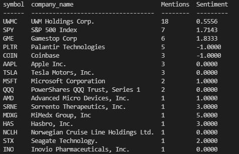

# Reddit Stock Search

## Description
This is a back-end application with the purpose of searching through the "WallStreetBets" subreddit page to gather data on stocks being talked about. As of right now,
it scans through the titles of each post in the "hot" category and references ticker mentions whith a stock database which can be found in this repository. The app also
uses a sentiment engine to measure the sentiment of each post title containing a stock. The sorted data is then uploaded to a mySQL database for use in other applications.

## Future Additions
* Scan through post text and comments on top of just titles
* Search for full company names rather than just ticker symbols
* Update the sentiment engine to understand reddit lingo a lot better (it's very inaccurate right now)
* Allow for continued scanning of reddit and updating the database rather than just when the server is started

## Software Used
* JavaScript
* Node.Js
* MySQL (via Sequelize)

## Instructions for use
* Ensure that you have MySQL downloaded to your device
* Clone the repository and type `npm install` into the command line to download the required packages
* Create a .env file in the root of your directory to add your MySQL environment variables
* You will also need to go to the reddit developer page to create a project account and obtain an access key
* Once you have all of the required variables, type `npm start` to run the program

## Demo Video
https://drive.google.com/file/d/1D9bQha67XV8h83xQz5L6rf9hRd2NerE7/view

## Images 
 

## Contact
* Email: kaletevans@gmail.com
